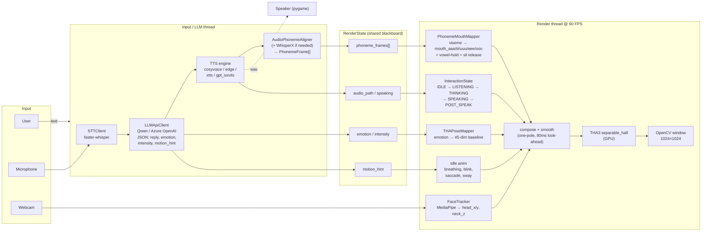

# THA AI VTuber

> A real-time, end-to-end AI VTuber pipeline:
> **Mic / Text → LLM → Cloud TTS → Phoneme Timeline → Viseme → Talking-Head-Anime-3 Renderer @ 60 FPS**

The renderer is built on **Talking-Head-Anime-3 (THA3)** by Pramook Khungurn
([original repository](https://github.com/pkhungurn/talking-head-anime-3-demo)).
This project embeds THA3 as the neural puppet backend and adds a complete real-time
chat / lip-sync / animation pipeline on top of it: a structured-JSON LLM brain, a
pluggable TTS layer with phoneme-accurate viseme generation, MediaPipe-based head
tracking, and a 5-state interaction state machine.

---

## Highlights

- **Single-image character** — any 512×512 anime portrait becomes an animated VTuber, no rigging.
- **60 FPS render loop** — `separable_half` THA3 model on a single CUDA GPU, smoothed with a one-pole filter and 80 ms phoneme look-ahead.
- **Streaming TTS pipeline** — sentence-level producer/consumer queue; first audio in ≈ 1.5 s.
- **Four pluggable TTS engines** (switchable via `TTS_ENGINE` env var):
  - `cosyvoice` — Aliyun DashScope CosyVoice v3.5+ cloud TTS, native character-level timestamps *(recommended, default)*
  - `edge`      — Microsoft Edge TTS (free, offline-friendly, native word boundaries)
  - `xtts`      — Coqui XTTS v2 voice cloning (local GPU, needs WhisperX alignment)
  - `gpt_sovits` — local GPT-SoVITS voice cloning API (needs WhisperX alignment)
- **Phoneme-driven lip-sync** — `pypinyin` + `g2p_en` → 5-dimensional viseme (`mouth_aaa/iii/uuu/eee/ooo`) → THA3 mouth params, with vowel-hold-peak, vowel→sil release tail, and adaptive blend ramps tuned for the 80–250 ms phonemes that CosyVoice produces.
- **WhisperX forced alignment** as a fallback for TTS engines without word-boundary metadata.
- **Pluggable LLM brain** — Azure OpenAI **or** DashScope Qwen via OpenAI-compatible mode, switchable by `LLM_PROVIDER`. Output is constrained to a strict JSON schema (`reply / emotion / intensity / motion_hint`) and split into sentences for streaming.
- **MediaPipe head tracking** — optional webcam input drives the character's `head_x / head_y / neck_z` in real time, with per-frame slew limiting.
- **5-state interaction state machine** — `IDLE / LISTENING / THINKING / SPEAKING / POST_SPEAK`, each with its own idle behavior (breathing, blinks, saccades, gaze, gentle sway).
- **Debuggable** — set `THA_LIPSYNC_DEBUG=1` to print per-phoneme requested-vs-actual mouth peaks (`[ls-peak]`), alignment trace (`[align]`), and lip-sync interpolation events (`[lipsync]`).

---

## Repository layout

```
tha_ai_vtuber/
├── ai_runtime/                 # The pipeline (LLM, TTS, alignment, renderer)
│   ├── tha_lip_sync_render.py     # ★ main entry point
│   ├── llm_api_client.py          # Azure OpenAI structured JSON
│   ├── cosyvoice_client.py        # Aliyun CosyVoice cloud TTS
│   ├── tts_client.py              # Edge TTS + audio utilities
│   ├── xtts_client.py             # Coqui XTTS v2 voice cloning
│   ├── gpt_sovits_client.py       # GPT-SoVITS voice cloning client
│   ├── stt_client.py              # Microphone STT
│   ├── forced_aligner.py          # WhisperX wrapper
│   ├── audio_phoneme_aligner.py   # Phoneme → viseme timeline
│   ├── phoneme_mouth_mapper.py    # Viseme → THA3 mouth params
│   ├── tha_pose_mapper.py         # Builds the full 45-dim THA3 pose vector
│   ├── face_tracker.py            # MediaPipe head tracking
│   ├── config_api.py              # .env-driven config
│   └── models/                    # Small Mediapipe assets (~4 MB)
├── tha3/                       # Bundled THA3 library (original code, MIT)
├── helpers/                    # Character-portrait preprocessing scripts
├── tests/                      # Standalone test / probe scripts
├── tools/                      # Animation / debug utilities
├── scripts/                    # Convenience launchers (run_text.bat, run_voice.bat)
├── docs/                       # Architecture + devlogs
├── data/
│   ├── images/                    # Sample portraits (CC-BY-NC, from THA3 upstream)
│   ├── voice/keqing.wav           # Reference clip for voice-cloning engines
│   └── models/                    # ★ THA3 weights (not bundled — see data/models/README.md)
└── models/                     # ★ Whisper / U²-Net (not bundled — see models/README.md)
```

---

## Setup

### 1. Python environment

Tested on Windows 10/11 with **Python 3.10**, CUDA 11.8 / 12.1.

```bash
git clone https://github.com/<your-account>/tha_ai_vtuber.git
cd tha_ai_vtuber
python -m venv venv
venv\Scripts\activate
pip install -r requirements.txt
```

PyTorch should be installed with the CUDA build matching your GPU, e.g.:

```bash
pip install torch torchvision --index-url https://download.pytorch.org/whl/cu121
```

### 2. Download model weights

#### 2a. THA3 renderer weights (required, ~1 GB)

The pretrained Talking-Head-Anime-3 weights are **not bundled** in this repo and must
be downloaded from the original author's release.

1. Go to the official THA3 project:
   <https://github.com/pkhungurn/talking-head-anime-3-demo>
2. Follow its README to download `tha3.zip` (the model weights archive).
3. Extract it so that the following four sub-directories appear directly under
   `data/models/` of **this** repo:

   ```
   data/models/
   ├── separable_float/     # ~55 MB
   ├── separable_half/      # ~28 MB   <-- default loaded by the renderer
   ├── standard_float/      # ~520 MB
   └── standard_half/       # ~260 MB
   ```

   Each sub-directory must contain these five `.pt` files:
   `editor.pt`, `eyebrow_decomposer.pt`, `eyebrow_morphing_combiner.pt`,
   `face_morpher.pt`, `two_algo_face_body_rotator.pt`.

4. The bundled `data/models/LICENSE.txt` is the upstream THA3 license and applies
   to those weights.

See [data/models/README.md](data/models/README.md) for the same instructions.

#### 2b. Faster-Whisper + U²-Net (for STT / alignment / portrait prep)

See [models/README.md](models/README.md) for download links
(~460 MB Whisper, ~170 MB U²-Net — U²-Net only needed by `helpers/remove_background.py`).

### 3. Configure credentials

```bash
copy .env.example .env
# then edit .env to fill in:
#   LLM_PROVIDER            (qwen | azure)
#   DASHSCOPE_API_KEY       (Qwen LLM and/or CosyVoice TTS)
#   AZURE_OPENAI_API_KEY    (only if LLM_PROVIDER=azure)
```

---

## Run

Text input (keyboard chat in a terminal, character speaks the reply):
```bash
python -m ai_runtime.tha_lip_sync_render --text
# or
scripts\run_text.bat
```

Microphone input (push-to-talk via STT):
```bash
python -m ai_runtime.tha_lip_sync_render --mic
# or
scripts\run_voice.bat
```

Switch TTS engine on the fly:
```bash
set TTS_ENGINE=edge
python -m ai_runtime.tha_lip_sync_render --text
```

If your GPU is tight on VRAM (THA3 + WhisperX competing), keep WhisperX on CPU:
```bash
set WHISPERX_DEVICE=cpu
```

---

## Architecture (1-minute tour)

Two long-lived threads share a `RenderState` blackboard:

- **Input/LLM thread** — collects user input (text or STT), calls the LLM, receives a
  JSON state + reply, fires the TTS request, then publishes the resulting
  `(audio_path, phoneme_frames, emotion, motion_hint)` onto the blackboard.
- **Render thread** — runs at 60 FPS, reads the blackboard each frame, composes a
  45-dim THA3 pose vector by stacking *(emotion baseline → idle motion → head
  tracking → mouth viseme)*, smooths it with a one-pole filter, and pushes it
  through the THA3 GPU poser to produce one RGBA frame.



A producer issues TTS requests sentence-by-sentence; the renderer keeps animating
(idle / blinking / breathing) the whole time and only enters `SPEAKING` once a fully
aligned phoneme timeline lands on the blackboard. See
[docs/architecture.md](docs/architecture.md) for the full module breakdown and the
lip-sync engineering notes.

---

## Acknowledgements

This project would not exist without the following:

- **Talking-Head-Anime-3 (THA3)** by **Pramook Khungurn** —
  https://github.com/pkhungurn/talking-head-anime-3-demo  (MIT License).
  The bundled `tha3/` library and `data/models/separable_*` / `standard_*` weights
  are his work. Sample portraits in `data/images/` (`crypko_*.png`, `lambda_*.png`)
  are also from the THA3 release and are licensed **CC-BY-NC**
  (see `data/images/CC-BY-NC.txt`).
- **WhisperX** — https://github.com/m-bain/whisperX
- **Faster-Whisper** — https://github.com/SYSTRAN/faster-whisper
- **Coqui XTTS v2** — https://github.com/coqui-ai/TTS
- **GPT-SoVITS** — https://github.com/RVC-Boss/GPT-SoVITS
- **Aliyun DashScope CosyVoice** — https://help.aliyun.com/zh/dashscope/
- **U²-Net** background remover — https://github.com/xuebinqin/U-2-Net
- **MediaPipe** Face Landmarker — https://developers.google.com/mediapipe

If you use this project in academic work, please also cite the original THA3 paper.

---

## License

Source code in this repository is released under the **MIT License**
(see [LICENSE](LICENSE)) — inherited from and compatible with the upstream THA3 repository.

The pretrained THA3 weights (downloaded separately) carry their own license shipped
inside `data/models/LICENSE.txt`.

The sample portraits under `data/images/` (`crypko_*`, `lambda_*`) are
**Creative Commons BY-NC**; see `data/images/CC-BY-NC.txt`.
