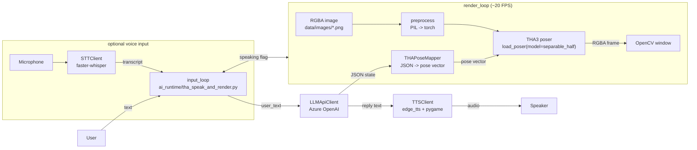

# Architecture (THA3 + LLM/TTS/STT)

This repo is an end-to-end **interactive avatar** demo built on `talking-head-anime-3-demo` (THA3):
- Input: text (and optional voice)
- Brain: LLM outputs **structured control JSON**
- Voice: TTS speaks the reply
- Animation: THA3 renders frames from a single RGBA character image + a low-dim pose vector

If the diagrams below show as plain text, your Markdown viewer does not support Mermaid.
- VS Code: install `Markdown Preview Mermaid Support` or `Markdown Preview Enhanced`
- GitHub: Mermaid renders automatically in `.md`

## 1. Repository Map (What Lives Where)

- `ai_runtime/`: “application layer” (LLM/TTS/STT + runtime demos)
  - `tha_speak_and_render.py`: text chat + TTS + real-time render loop
  - `tha_pose_mapper.py`: JSON(state) -> THA pose vector
  - `llm_api_client.py`: Azure OpenAI -> strict JSON
  - `tts_client.py`: edge-tts + pygame playback
  - `stt_client.py`: faster-whisper (optional voice input)
  - `run_voice_chat.py`: STT -> LLM -> TTS (no render)
- `tha3/`: THA3 core (poser networks, utilities, GUI apps)
  - `poser/modes/*`: model variants (`standard_*`, `separable_*`)
- `data/`:
  - `images/`: input character RGBA images
  - `models/`: THA3 model weights (`standard_*`, `separable_*`)
- `models/`: third-party models (e.g. Whisper, U2Net)

## 2. Core Data Contracts

### 2.1 LLM Output JSON Schema
The LLM is constrained to output a single JSON object:
- `reply`: string
- `emotion`: `neutral|happy|sad|angry|surprised|thinking`
- `intensity`: number `0..1`
- `motion_hint`: `none|nod|shake|tilt_left|tilt_right`

Implementation: `ai_runtime/llm_api_client.py`.

### 2.2 Runtime Render State
The runtime keeps a small shared state:
- `emotion`, `intensity`, `motion_hint`
- `speaking` (TTS in progress)
- `speak_start` (for mouth animation timing)

Implementation: `ai_runtime/tha_speak_and_render.py`.

## 3. System Overview Diagram



## 4. Runtime Sequence (What Happens Per Turn)

```mermaid
sequenceDiagram
  autonumber
  participant User
  participant Input as input_loop (thread)
  participant LLM as Azure OpenAI
  participant TTS as edge-tts/pygame
  participant Render as render_loop (thread)
  participant THA as THA3 poser (GPU)

  User->>Input: type text
  Input->>LLM: chat(user_text)
  LLM-->>Input: JSON(reply, emotion, intensity, motion_hint)
  Input->>Input: set speaking=true; set state
  Input->>TTS: speak_async(reply)

  loop ~20 FPS
    Render->>Render: build target pose<br/>(mapper + idle + mouth)
    Render->>THA: pose(image, pose_vector)
    THA-->>Render: frame
    Render->>Render: smooth pose (EMA)
  end

  TTS-->>Input: playback finished
  Input->>Input: set speaking=false
```

## 5. Pose Control Surface (What Can Be Animated)

THA3 exposes a fixed set of pose parameters (same across `standard_*` / `separable_*` variants in this repo):
- Face: eyebrows / eyes / iris morph+rotation / mouth shapes
- Rotation: `head_x`, `head_y`, `neck_z`, `body_y`, `body_z`
- `breathing`

Important limitation:
- No per-limb joint DOFs (no `arm/hand/elbow/...`). This means the current system can do **face + head/upper-body motion**, but not arm gestures.

Parameter definition lives in `tha3/poser/modes/pose_parameters.py`.

## 6. Known Constraints (Engineering Reality)

- Input image constraints are strict (RGBA, upright, hands away from face, head roughly centered, etc.). See `README.md` for the spec.
- GPU requirement: THA3 is heavy; real-time depends on CUDA GPU.
- The system currently drives mouth with a simple heuristic (not true viseme lip-sync).

## 7. Quality Optimization Plan (8 Weeks, Feasible)

### 7.1 Goals (What “quality” means here)
- Expressiveness: avatar looks “alive” when idle and reacts meaningfully
- Lip-sync: mouth movement correlates with audio energy and timing
- Robustness: handles more user images with preprocessing and clear feedback
- Responsiveness: low perceived latency, stable FPS

### 7.2 Week-by-Week Roadmap
1. Weeks 1-2: Animation polish (no new dependencies)
   - Add richer idle: blink, saccades (iris micro-move), breathing cycle, subtle head/neck/body sway
   - Add emotion transition smoothing: avoid sudden jumps when emotion changes
   - Expand motion_hint vocabulary inside current DOFs: look_left/right/up/down (iris), lean (body_y/z)

2. Weeks 3-4: Audio-driven mouth (biggest perceived improvement)
   - Replace rule-based `mouth_open` with audio envelope driven by the actual TTS waveform
   - Add latency-safe buffering: compute envelope once per utterance; feed render loop in real time
   - Optional: basic viseme approximation by mapping envelope + rough phoneme classes (time permitting)

3. Weeks 5-6: Input image preprocessing + validation
   - Auto background removal (U2Net), enforce alpha
   - Auto crop/align to match THA3 expected framing (face-centered; 512x512)
   - Add “input quality checker” that prints actionable errors instead of failing silently

4. Weeks 7-8: Engineering hardening + evaluation
   - Add simple metrics logging: end-to-end latency, FPS, LLM/TTS time
   - Add fallback modes: CPU / lower FPS / lower resolution (if GPU is weak)
   - Create a short demo script + repeatable test prompts to show improvements

### 7.3 Suggested Deliverables for the Final Demo
- 1-minute live demo: text -> spoken response + expressive animation
- A/B comparison video: before/after mouth sync + idle polish
- A small “supported input” gallery (good/bad examples) with preprocessing results

